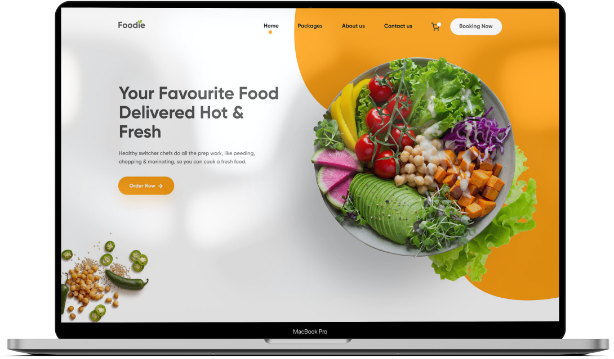

<h1 align="center">
    
</h1>

    
    
     
    

  <a href="#bookmark-sobre">Sobre</a>&nbsp;&nbsp;&nbsp;|&nbsp;&nbsp;&nbsp;
  <a href="#robot-demo">Demo</a>&nbsp;&nbsp;&nbsp;|&nbsp;&nbsp;&nbsp;
  <a href="#rocket-tecnologias">Tecnologias</a>&nbsp;&nbsp;&nbsp;|&nbsp;&nbsp;&nbsp;
  <a href="#paintbrush-layout">Layout no Figma</a>&nbsp;&nbsp;&nbsp;|&nbsp;&nbsp;&nbsp;
  <a href="#memo-licença">Licença</a>

  

## :bookmark: Sobre

O **Foodie** é uma aplicação desenvolvida através da disciplina de LIMA (Linguagem de marcação) sob orientação do professor [Fernando Leonid](https://github.com/fernandoleonid).

Este layout foi baseado em um projeto de [Shakib Ali](https://www.behance.net/Shakibali), atualmente vinculado ao Behance.

## :robot: Demo

Você pode encontrar a versão demo em Live Preview [clicando aqui](
ericknathan.github.io/projeto-foodie/ ) hospedado no GitHub Pages.

## :rocket: Tecnologias

-  [HTML](https://developer.mozilla.org/pt-BR/docs/Web/HTML/)
-  [CSS](https://developer.mozilla.org/pt-BR/docs/Web/CSS/)
-  [Tilt.js](https://gijsroge.github.io/tilt.js/)

## :paintbrush: Layout

Clique aqui para abrir o layout do projeto no [Figma](https://www.figma.com/file/EmiscgdjSjOqOn1P4uN7UT/Foodie-Layout?node-id=25%3A138) feito por [Erick Nathan](https://www.github.com/ericknathan/).

## :memo: Licença

Esse projeto está sob a licença MIT. Veja o arquivo [LICENSE](LICENSE) para mais detalhes.
